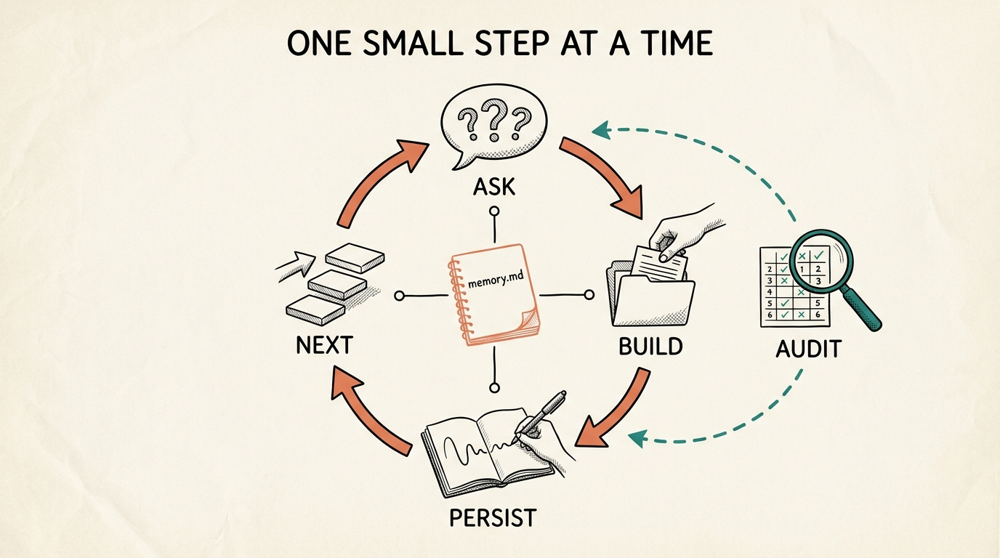

<p align="right"><a href="README.md">🇺🇸 English</a> · <b>🇧🇷 Português</b></p>

# /os-coach

> **O que é isto, em uma frase:** uma skill do Claude Code que pega na sua mão e te guia, passo a passo, na construção do seu próprio **OS agêntico** (um sistema operacional feito de arquivos, que entende o seu objetivo e trabalha por você), uma camada de cada vez, dentro de qualquer pasta. Você não precisa saber programar. A skill faz o trabalho técnico. Você só toma as decisões.

Pense nela como um treinador particular. Você diz aonde quer chegar, ela faz duas ou três perguntas em português claro, e então **constrói os arquivos e pastas de verdade** para você, explicando o que fez e por quê. Sessão após sessão, ela lembra exatamente onde você parou.

Tudo se apoia numa única ideia: **um OS agêntico é, na maior parte, encanamento. O modelo de IA é os 20% baratos.** Você não consegue conversar com os seus dados se os bastidores estão uma bagunça. Por isso a skill arruma os bastidores primeiro, e só depois empilha capacidade em cima.

<p align="center">
  
</p>

> Seis camadas, construídas de baixo para cima. A Identidade é a fundação, o Substrato (os bastidores) é a maior camada, e os Agentes ficam no topo, só depois que tudo abaixo deles está firme.

---

## O que ela faz

Você roda `/os-coach` dentro de qualquer pasta e diz qual é o seu objetivo. A skill:

1. **Inicia um OS de verdade** naquela pasta, registra o seu objetivo com as suas próprias palavras, e lembra exatamente onde você está entre as sessões, num arquivo `memory.md`.
2. **Treina uma camada de cada vez.** Faz 2 ou 3 perguntas em português simples, espera a sua resposta, então constrói os arquivos e pastas de verdade para você e explica o que criou e por quê.
3. **Nunca fala como um manual.** Sem jargão. Quando uma palavra técnica é inevitável, ela ganha uma frase curta e uma analogia do dia a dia. Ela assume que você nunca abriu um terminal na vida.
4. **Se recusa a ser genérica.** Toda sugestão é ancorada no seu objetivo real e no que de fato está na sua pasta agora, não em conselho de manual.
5. **Audita quando você pedir.** Peça uma avaliação e ela pontua todas as seis camadas em relação ao seu objetivo, te dá os três próximos movimentos de maior alavancagem em ordem de prioridade, e escreve o relatório em `OS-AUDIT.md`.
6. **Protege o que você marca como sensível.** Se você marca um campo como privado, ela nunca escreve aquele valor na pasta; guarda no lugar uma referência que não te identifica.

---

## As seis camadas

Ela constrói e audita as camadas na ordem que realmente funciona.

| # | Camada | O que é | Mora em |
|---|---|---|---|
| 1 | **Identidade** | A alma. Quem é este OS, quem ele serve, do que ele se recusa a fazer. | `CLAUDE.md` |
| 2 | **Substrato / Contexto** | Os bastidores. O conhecimento destilado em que o OS roda. A maior camada. | `substrate/` |
| 3 | **Regras & Hooks** | As cercas. Restrições preto-no-branco e reflexos automáticos. | `rules/` |
| 4 | **Skills** | Os verbos conquistados. Tarefas repetíveis empacotadas para rodar igual toda vez. | `skills/` |
| 5 | **Ferramentas / Conexões** | Os fios para fora. Conexões somente-leitura e bem delimitadas a fontes de dados reais. | `tools.md` |
| 6 | **Agentes** | Papéis com julgamento que orquestram as skills. | `agents/` |

---

## Como uma sessão flui

Você dá sempre só um pequeno passo por vez. O treinador faz 2 ou 3 perguntas em português claro, constrói os arquivos de verdade quando você responde, anota onde você está, e te aponta a próxima camada. Tudo lê e escreve num mesmo `memory.md`, então ele sempre sabe de onde você parou, mesmo sessões depois. Peça uma auditoria a qualquer momento e ele pontua o OS inteiro em relação ao seu objetivo e devolve o resultado para dentro do ciclo.

<p align="center">
  
</p>

1. **Pergunta** algumas perguntas simples sobre a camada atual, então para e espera.
2. **Constrói** o arquivo ou pasta de verdade daquela camada quando você responde, sob medida para o seu objetivo.
3. **Persiste** a decisão e o seu lugar em `memory.md`, para que nada se perca entre os turnos.
4. **Próximo**, segue para a camada de baixo ou de cima conforme a ordem de construção mandar.
5. **Audita** quando você pede, pontuando cada camada em relação ao seu objetivo e escrevendo `OS-AUDIT.md`, que realimenta os próximos movimentos.

---

## Comandos

```
/os-coach start <seu objetivo>   Começa um OS novinho em folha
/os-coach next                   Vai para a próxima camada não terminada e treina ela
/os-coach layer <nome>           Pula para uma camada específica (identity, substrate, rules, skills, tools, agents)
/os-coach status                 Mostra o mapa de progresso a partir da memória
/os-coach audit                  Pontua o OS inteiro em relação ao seu objetivo e te dá os próximos passos
/os-coach help                   Explica o que ela faz e mostra os comandos
```

---

## Instalação

```bash
cp -r os-coach ~/.claude/skills/
```

Depois, dentro de qualquer pasta que você queira transformar num OS:

```
/os-coach start Quero nunca mais perder o prazo de um cliente
```

### Pré-requisitos

- [Claude Code](https://claude.com/claude-code) instalado
- É só isso. Sem dependências, sem chaves de API, sem etapa de build.

---

## O que ela cria

Tudo aparece na pasta em que você a roda, então a pasta *é* o OS:

- `memory.md`, o estado corrente, para o treinador sempre saber de onde você parou.
- `CLAUDE.md`, a sua camada de Identidade, o arquivo-alma enxuto que o OS inteiro lê primeiro.
- `substrate/sources.md` e `substrate/compendium.md`, os bastidores.
- `rules/always.md` e `rules/never.md`, as suas cercas.
- `skills/<nome>/SKILL.md`, a sua primeira tarefa repetível.
- `tools.md`, as conexões somente-leitura de que o seu objetivo precisa.
- `agents/<nome>/AGENT.md`, o primeiro papel que vale promover, uma vez que as skills existam.
- `OS-AUDIT.md`, um boletim guardável sempre que você roda uma auditoria.

---

## Um exemplo de verdade

Aqui está uma execução real, condensada. Uma fotógrafa de casamento autônoma quer parar de perder prazos. Os clientes aparecem como `Casal A`, `Casal B` porque a fotógrafa marcou os nomes dos clientes como sensíveis, então o treinador guarda referências que não identificam em vez dos nomes reais.

**Você:**

```
/os-coach start Eu vivo perdendo prazos de cliente e quero nunca mais atrasar uma entrega
```

O OS Coach confirma o objetivo, prepara a pasta, e faz três perguntas curtas: para quem isto é, a única pergunta que você gostaria de poder simplesmente fazer a ele, e uma coisa que ele deve sempre fazer mais uma que ele nunca deve fazer. Você responde: só eu; "o que vence nos próximos 10 dias e do que eu já estou atrasada"; sempre me avise dentro de 3 dias de uma data contratada; nunca mande mensagem para um cliente sem a minha aprovação. Ele então escreve o seu arquivo de Identidade:

```markdown
# Quem eu sou
Eu sou o sistema operacional de uma fotógrafa de casamento autônoma. Eu existo para que nenhuma entrega de cliente atrase nunca.
...
## Recusas inegociáveis (nunca)
- Eu nunca mando mensagem para um cliente sem você ler e aprovar antes.
- Eu nunca deixo um prazo passar em silêncio. Se algo está em risco, eu levanto a bandeira alto.
```

**Você:** `/os-coach next`

Ele abre o Substrato, pergunta onde moram os seus agendamentos e o que é sensível, então constrói um rastreador que calcula os dois prazos a partir da data de cada casamento (a prévia é casamento mais 1 semana, a galeria completa é casamento mais 6 semanas) e responde a sua pergunta na hora:

```
Dentro de 3 dias, a sua linha de sempre-avisar acabou de disparar:
- Casal B, galeria completa vence em 2026-07-01 (faltam 3 dias)

Vencendo dentro de 10 dias:
- Casal C, prévia vence em 2026-07-02 (faltam 4 dias)
```

**Você:** `/os-coach audit`

```
## Boletim
| Camada     | Nota        | Por quê |
|------------|-------------|---------|
| Identidade | Sólida      | O CLAUDE.md declara a missão e duas recusas. |
| Substrato  | Iniciada    | O rastreador responde "vence em breve" mas ainda não "já está atrasado" até você marcar o que foi entregue. |
| Regras     | Faltando    | As referências dos clientes agora moram na pasta sem nada impedir um backup público. |

## Os três movimentos que mais importam
1. Regras: escreva rules/never.md (nunca faça backup público desta pasta). Um vazamento não tem como desfazer, e uma galeria vence em 3 dias.
2. Substrato: marque quais galerias foram entregues para que "vence em breve" também consiga responder "já está atrasado".
3. Skills: transforme a checagem de prazo em um comando repetível.
```

Sua pasta agora se parece com isto:

```
photo-os/
  CLAUDE.md          # Identidade, a alma
  memory.md          # de onde você parou
  substrate/
    sources.md       # onde os dados reais moram
    compendium.md    # o rastreador de prazos
  OS-AUDIT.md        # o boletim mais recente
```

Cada arquivo é real, ancorado no seu objetivo, e seu para guardar.

---

## Como ela é construída

- `SKILL.md`, o controlador. É invocada só pelo usuário, guarda as regras de ouro (fale como gente, um pequeno passo por vez, quem constrói é você, nunca seja genérica, sempre persista, proteja dados sensíveis, sem travessões), as guardas, e a lógica de cada fluxo.
- `references/layer-playbook.md`, o detalhe de treino de cada camada: uma explicação em português claro, uma analogia, as 2 ou 3 perguntas a fazer, o artefato a construir, e a checagem de pronto.
- `references/audit-rubric.md`, como pontuar cada camada (Faltando, Iniciada, Sólida, Compondo), o teste de não-genérico, a precedência de priorização, e as checagens de campo sensível e de escrita de volta.

As referências são carregadas só quando necessário, então o controlador fica enxuto.

---

## Perguntas frequentes

**Eu preciso saber programar?**
Não. O treinador faz todo o trabalho técnico, ele cria os arquivos e pastas para você. Você só responde perguntas em português claro e toma as decisões. Ele assume que você nunca abriu um terminal.

**Meus dados saem da minha máquina?**
Não. Tudo o que ele constrói são arquivos comuns na pasta em que você o rodou. A camada de Ferramentas conecta às suas fontes em modo somente-leitura e mantém segredos (senhas, chaves) fora da pasta. Se você marca um campo como sensível, o treinador guarda uma referência que não te identifica em vez do valor real, e nunca escreve um arquivo que diz excluir um campo e então o inclui.

**Quanto custa ou o que exige?**
Só o Claude Code. Sem chaves de API, sem dependências, sem etapa de build. Você roda `/os-coach` e vai.

**E se uma camada ainda não se aplica a mim?**
O treinador a marca como `não iniciada` com um motivo de uma linha, em vez de inventar trabalho para inglês ver, e segue em frente. Você nunca é empurrado a construir um agente antes de existirem as skills que ele orquestraria.

**Em que isso difere de só escrever um `CLAUDE.md`?**
Um `CLAUDE.md` é apenas a camada de Identidade. O OS Coach constrói todas as seis camadas, mantém elas coerentes, e as audita em relação ao seu objetivo ao longo do tempo. A Identidade é a alma, mas o substrato, as regras, as skills, as ferramentas e os agentes são o que fazem o OS de fato trabalhar.

**Isso é só para empresas?**
Não. Qualquer objetivo com bastidores funciona: uma prática de pesquisa, uma busca por emprego, uma casa, um pipeline criativo. Se você tem conhecimento espalhado e uma coisa que gostaria de poder simplesmente perguntar, serve.

**Onde ele guarda de onde eu parei?**
No `memory.md` da sua pasta. Toda execução o lê primeiro e o atualiza por último, então você pode parar no meio de uma construção e retomar depois, mesmo numa sessão nova, sem perder o seu lugar.

**Posso editar o que ele constrói?**
Pode, e deve. Os arquivos são seus. Edite-os direto, então rode `/os-coach audit` para ver como as suas mudanças pontuam em relação ao seu objetivo.
